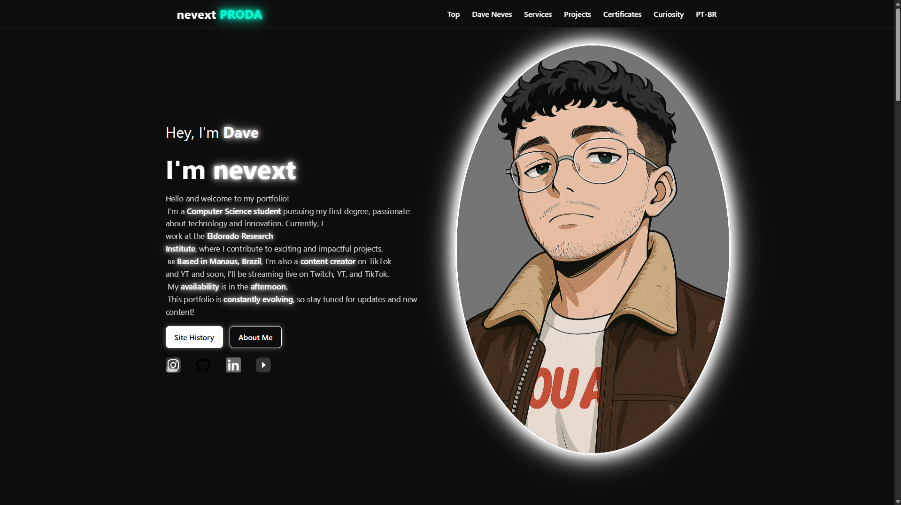

# Dave Neves | Official Portfolio



## 🚀 Features

- **Multi-language Support**: Seamless toggle between English (US) and Portuguese (BR).
- **Interactive Typing Effect**: Dynamic hero section highlighting different roles.
- **Neon Aesthetic**: Custom-built CSS design with glassmorphism and vibrant glow effects.
- **Project Showcase**: Grid-based project section with custom preview banners and private project integration.
- **Progressive Certificates**: Animated progress bars for ongoing education and courses.
- **Responsive Design**: Fully optimized for mobile, tablet, and desktop viewing.

## 🛠️ Technologies Used

- **HTML5**: Semantic structure.
- **CSS3**: Vanilla CSS with custom variables, keyframe animations, and HSL color palettes.
- **JavaScript**: Custom logic for language toggling, typing effects, modals, and interactive UI.
- **Asset Management**: Optimized "KISS" directory structure for images and media.

## 📁 Project Structure

```text
/
├── index.html        # Main entry point
├── img/              # Portfolio images, icons, and avatars
├── audio/            # Media assets and background tracks
└── README.md         # Documentation
```

## 💻 How to Run Locally

1. Clone the repository:
   ```bash
   git clone https://github.com/nevext/portfolio.git
   ```
2. Open `index.html` in your preferred web browser.

## 🤝 Contact

- **Instagram**: [@nevexttv](https://www.instagram.com/nevexttv/)
- **LinkedIn**: [David Neves](https://www.linkedin.com/in/nevesxt/)
- **YouTube**: [NevextTV](https://www.youtube.com/@NevextTV)
- **Email**: nevext@outlook.com

---
*Created with ❤️ by Dave Neves*
